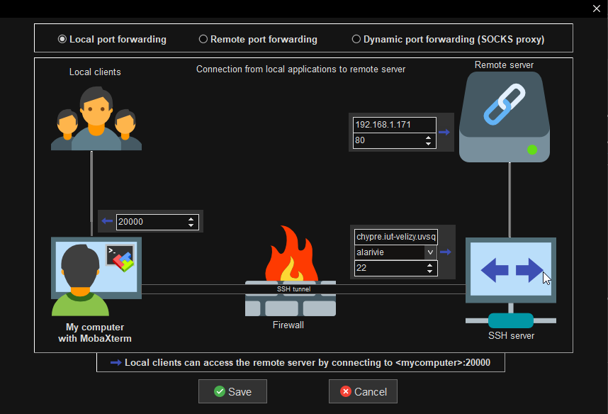

# Documentation Raspberry
___
Rédacteur : Angelo LARIVIERE  
Groupe SAE :  Quentin Rocher, Khaoula Hajbi, Erwan Barbier, Angelo LARIVIERE 
___
___
## connexion  au Raspeberry

Pour ce connecter au raspeberry nous avons a notre disposiion deux moyents :  
> Nous pouvons nous connecter garce au serveur titan directement depuis un terminal linux en entrant la ligne de comamnde suivant  
> ```
>ssh saepi@192.168.1.171
> ```  
>

> Mais nous avons aussi mit en place un tunnel ssh pour pouvoir nous connecter en dehors du resaux de l'iut pour se fair nous avons installer **MobaXterm** et **Putty**.  
>Tout d'abord **MobaXterm** qui vas nous servir a nous conecter direcetement a Serveur du Raspebery est d'y accéder par naviguateur web.  
>**Putty**, luis nous permet de nous connecter d'abors a titant par tunnelle ssh puis ensuit on peut reaccéder au raspberri grace a la commande
>```
>ssh seapi@192.168.1.171
>```

### Configuration Putty


### Configuration MobaXterm


Ici l'utilisation de Putty et de MobaXterm a été choisi car MobaXterm permet d'utiliser putty avec une interface graphique permettant une meilleur faciliter d'utilisation, mais il permet aussi de réaliser un tunnel ssh pour se connecter au raspberry depuis son ordinateur personnel.  

___
___  
## Mettre en place les différents serveurs  
Pour cette SEA nous avons besoin d'installer deux serveur tout d'abord pour mettre notre serveur qui contientdras le site web avec les simulation nous avons choisit d'installer **apache** ; pour stocker la base de donner nous avons choisit d'installer **Mysql**.
Mais avant de faire tout les instalations nous devons verifiez que le rasberry est à jour :  

### Mise a jour du systeme du raspberri
pour mettre a jour le systeme du rasberri nous avons besoin de la commande 
```
sudo apt update
```

mais nous avons aussi besoin de la commande
```
sudo apt upgrade
```
 apres avoir taper ces commandes on pourras passer aux instalations des serveur sur le rasberri 

### Mise en place de apache
Pour installer apache sur les rasberrie il faut tapper la commande 
```
sudo apt install apache2
```
cette commande installera apache sur le rasberri; a la fin de l'execution de la commande nous pourrons configurer le serveur afin d'afficher notre site web

### Mise en place de Mysql
pour installer Mysql nous avons besoin d'autre commande permettant l'instalation   
``` 
wget https://dev.mysql.com/get/mysql-apt-config_0.8.22-1_all.deb
 ```   
permetant de récuperer les paquets pourt installer Mysql

```
 sudo apt-get install ./mysql-apt-config_0.8.22-1_all.deb
```
puis permettant d'installer les package utile a l'installation de Mysql  
on fini par installer Mysql-server nous permettant d'avoir un server utilisant Mysql que nous pourront utuliser avec notre code  
```
sudo apt-get install mysql-server
```  
suite a cette commande nous aurrons acces a des parametre de configuration nous permettant entre autre de créé une base de donnée que nous appeleron **_notrebase_**, mais aussi un utilisateur **_root_** nous permettant d'acceder plutard a la fin de la configuration de Mysql  


### Configuration de apache
Dans notre projet nous avons organise notre site web en plusieur sous fichier et tout c'est fichier on été déposer sur git et sont donc dans un dépot; Appache fonctionne grace a un fichier source stocker dans les Dossier ```var/WWW/html``` et s'appel ```index.html``` notre but est donc de remplacer ce fichier par le notre pour que appache demare sur notre site:  

Plusieur problème se sont présenter a nous tout d'abords des securiter en peche de deplacer l'emplacement de ```index.html``` dans notre depot git se trouvant dans ```/home/saepi/sae_semestre3_projet/``` car /home n'apparait n'est pas sous le même utilisateur, ma seconde idée etait donc de mettre le dépôt git dans le dossier ```var/WWW/html``` mais des securiter empeche de clonner un dépot dans ce dossier   
la solution que nous avons appliquer est de déplacer le dossier de l'application web dans le dossier ```var/WWW/html``` avec la commande :  
```
cp -r /home/saepi/sae_semestre_projet/ApplicationWeb /var/www/html
```
on noublie pas de suprimer le ```index.html``` en se placant dans le dossier ```var/WWW/html```
```
sudo rm index.html
```
en ajoutant dans le fichier _000-default.conf_ ce trouvant dans le dossier ```etc/apache2/site-enable``` et en ajoutant de le fichier _apache2.conf_ ce trouvant dans le dossier ```etc/apache2/```  
dans ces deux fichiers on ajoute la ligne ```/var/www/html/ApplicationWeb```


### Configuration de Mysql

la configuration de mysql est plus simple car il suffi de ce conecter au service de mysql :
```
mysql -u root -r
```

on vas par la suite crée un utilisateur _user_ avec un mot de passe **_test_** cela vas nous permettre d'acceder au tables garce a nos script php

```
create user user identified by 'test';
```  
on ajoute les droit a l'utilisateur  
```
grant all privileges on notrebase.* to 'user';
```  
```
flush privileges;
```

suite a cela en executant notre scripte pour crée la base de donne on optient nos tables   

  

et la configuration du raspberry est fini
___
___
## Securisation du Raspberry
Pour la scéruter du raspberry nous avons tous d'abord verifier que le raspberry etait a jours
```
 sudo apt update
 
 sudo apt upgrade
 ````
suite a sa nous avaons en suite installer un processus permettant de mettre en quarentaine les ip des personne voulant se connecter est c'étant trompé 5 fois.


On peut donc voir dans cette image la plusieur ligne :

```
bantime = 1h
```
cette ligne sert a definir le temps de ban des ips

## Changer le mots de passes

### mot de passe de conexion au raspberry  

pour modifier le raspberry nous utilisons la commande :  
```
passwd
```


suite a cette commande le nouveaux mot de passe du raspberry :  
**_48h56h_**  

### mot de passe root du raspberry

pour le mot de passe de root on tape la commande :  
```
sudo passwd
```


suitte a cette commande le nouveaux mot de passe root du raspberry :  
**_48-56-_**
